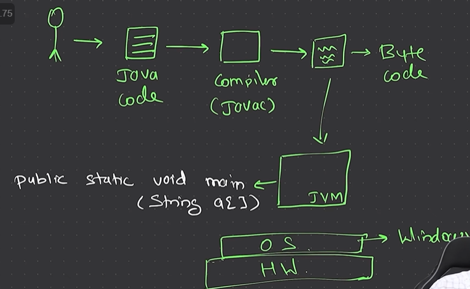
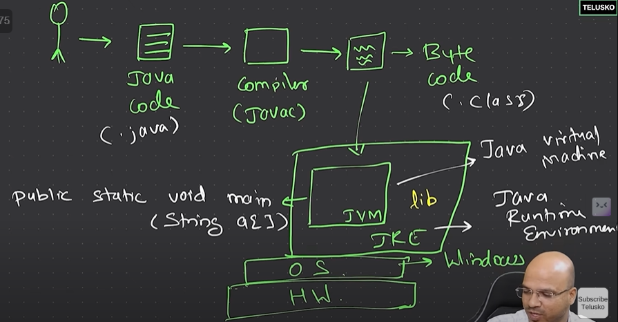
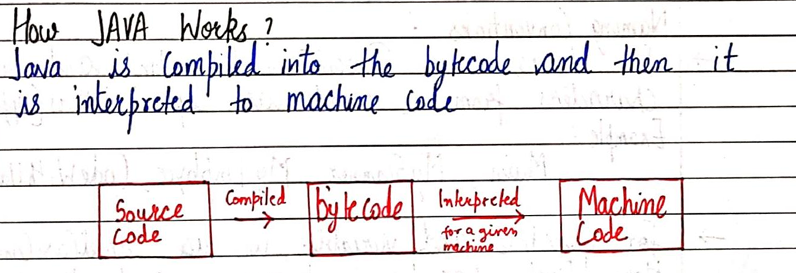

* type `jshell` to go in jshell and type `/exit` to leave
* to compile : `javac <filename.java>`

* hello.class is our bytecode (.class) for hello.java 
* run bytecode using `java <filename_without_extension>
* JRE: Java Runtime Environment
### HOW JAVA WORKS: 
  
* JDK (Java Development Kit) will have JRE and JRE will have JVM... So once java code is written it will only require JRE to run. This makes java WORA (write once, run anywhere)
* Programmer writes code in .java file. That code that compiled by javac and converts to bytecode .class file. .class file can be run on JVM

Java is first compiled to bytecode and then interpretted to machine code. 

## VARIABLES:
* Database is permanent storage, what if we want to store an input from the user, we use variables for that. 

Data types 

By default: double 
`float num2 = 3.5;` // Type mismatch: cannot convert from double to float
use `float num2 = 3.5f` 